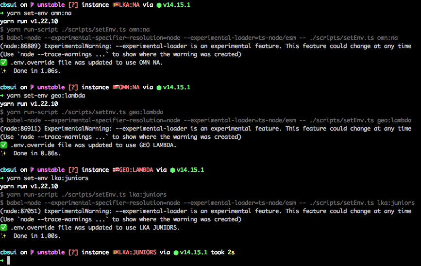

# cbs-zsh-spaceship-env-section
Show current CBS instance + team in your prompt according to your .env.override file. Only [SpaceShip Prompt](https://spaceship-prompt.sh) is supported but I think this could be pretty easily ported to other prompts.

# Installation
1. Copy content of file `env-section.sh` file from this repo to your prompt config located in `~/.zshrc`
2. Add `cbs` to your `SPACESHIP_PROMPT_ORDER` variable in `~/.zshrc`, if you don't have it here, [copy it from docs](https://spaceship-prompt.sh/options/#order).
3. Close and open your terminal.
4. That's it. Enjoy.

